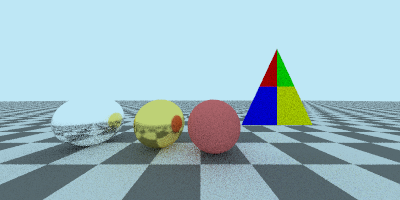

# C++ Ray Tracer / Path Tracer

Educational CPU-based ray tracing renderer implemented in C++.

This project started as a Whitted-style ray tracer and has gradually evolved into a small path tracing renderer with material abstraction, BVH acceleration, texture mapping, and OBJ mesh loading.

## Showcase



Final V1.0 showcase scene rendered at 400 × 200 resolution with 200 samples per pixel. The scene demonstrates Lambertian, metal and dielectric materials, OBJ mesh loading, UV image texture mapping, and a world-space checker texture.

## Overview

This project is built from scratch for learning computer graphics and C++ engineering.

It focuses on the complete rendering pipeline:

```text
Scene
→ Camera Ray Generation
→ BVH Traversal
→ Ray-Object Intersection
→ Hit Record
→ Material Scatter
→ Texture Sampling
→ Recursive Color Evaluation
→ PPM Output
```

The current version supports spheres, planes, triangles, OBJ meshes, image textures, checker textures, BVH acceleration, and OBJ `v / vt / vn` asset import.

The project is now entering the V1.0 polishing stage. The main goal is no longer adding more features, but improving documentation, project presentation, stability, and explanation quality.

## Features

### Core Rendering

- [x] Perspective camera ray generation
- [x] Recursive ray color evaluation
- [x] Path tracing style material scattering
- [x] Supersampling anti-aliasing
- [x] Gamma correction
- [x] PPM image output
- [x] Render statistics output

### Geometry & Intersection

- [x] Sphere intersection
- [x] Plane intersection
- [x] Triangle intersection using Möller-Trumbore algorithm
- [x] Mesh object composed of triangles
- [x] AABB bounding box
- [x] BVH acceleration structure

### Materials

- [x] Lambertian diffuse material
- [x] Metal material with roughness
- [x] Dielectric material with refraction
- [x] Schlick approximation for reflectance
- [x] Material abstraction through virtual `scatter()`

### Textures

- [x] Checker texture
- [x] PPM image texture
- [x] Texture abstraction
- [x] UV-based texture sampling
- [x] OBJ mesh texture mapping through `vt`

### OBJ Mesh Loading

- [x] OBJ vertex position parsing: `v`
- [x] OBJ texture coordinate parsing: `vt`
- [x] OBJ vertex normal parsing: `vn`
- [x] OBJ face parsing: `f v/vt/vn`
- [x] Mesh construction from OBJ faces
- [x] Triangle UV interpolation
- [x] Vertex normal interpolation for smooth shading

## Build

Using Git Bash / MSYS2 on Windows:

```bash
g++ src/*.cpp -Iinclude -o raytracer
```

If using the provided Makefile:

```bash
make
```

## Run

```bash
./raytracer.exe
```

or:

```bash
./raytracer
```

The renderer outputs a `.ppm` image file.

## Example Render Statistics

Example result from the current version:

```text
Scene validation passed: all objects have valid materials.
Render progress: 100%
Render time: 11.9476 seconds
Total rays: 16000000
Rays per second: 1.33918e+06 rays/s
```

## Asset Import Pipeline

The OBJ mesh data flow is:

```text
OBJ file
→ OBJLoader
→ OBJData(vertices, texcoords, normals, faces)
→ Mesh
→ Triangle
→ hit_record
→ Material / Texture
→ Final color
```

## UV Texture Pipeline

The OBJ texture coordinate pipeline is:

```text
OBJ vt
→ OBJData.texcoords
→ Mesh
→ Triangle uv0 / uv1 / uv2
→ barycentric interpolation
→ rec.u / rec.v
→ ImageTexture::value(u, v, p)
→ Final color
```

This means reading `vt` from an OBJ file is not enough. The UV data must continue through Mesh, Triangle, hit record, and Material before it can affect the final image.

## Vertex Normal Pipeline

The OBJ vertex normal pipeline is:

```text
OBJ vn
→ OBJData.normals
→ Mesh
→ Triangle n0 / n1 / n2
→ barycentric interpolation
→ rec.normal
→ Material scatter
→ Final color
```

This allows smooth shading by interpolating vertex normals at the hit point instead of using only one face normal per triangle.

Smooth shading does not change the actual geometry. It changes the normal used for lighting calculation, making the rendered surface appear smoother.

## Main Structure

```text
raytracer/
├── include/            # Header files
├── src/                # Source files
├── output/             # Rendered images
├── Makefile            # Linux / general build script
├── Makefile.win        # Windows build script
├── compile.bat         # Windows compile helper
├── .gitignore
└── README.md
```

Important modules:

- `OBJLoader`: parses OBJ `v / vt / vn / f` data
- `Mesh`: converts OBJ faces into triangles
- `Triangle`: handles intersection, UV interpolation, and normal interpolation
- `Material`: defines scattering behavior
- `Texture`: provides procedural or image-based color sampling
- `BVH`: accelerates ray-object intersection
- `Logic`: handles recursive ray color computation

## Current Project Status

The current version has completed:

- Basic recursive rendering pipeline
- Material abstraction
- Texture abstraction
- BVH acceleration
- OBJ mesh loading
- OBJ UV texture mapping
- OBJ vertex normal smooth shading
- Render statistics output
- Stable compilation and execution on the current Windows/MSYS2 environment

This project has moved beyond the initial “render a few spheres” stage and now has a relatively complete rendering and asset import pipeline.

## Current Limitations

- Single-threaded CPU rendering only
- PPM image input/output only
- No mesh-level BVH inside large OBJ models yet
- Scene construction is still hard-coded in C++
- No advanced sampling strategy such as MIS
- No GUI or real-time preview
- Limited image format support

## Future Work

- [ ] Add mesh-level BVH for complex OBJ models
- [ ] Improve scene configuration
- [ ] Add more image formats
- [ ] Improve sampling strategy
- [ ] Add better render output workflow
- [ ] Improve project documentation and visual presentation
- [ ] Prepare V1.0 project review and resume description

## License

This project is created for educational purposes.